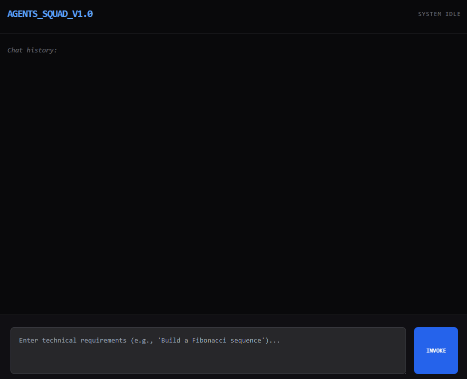
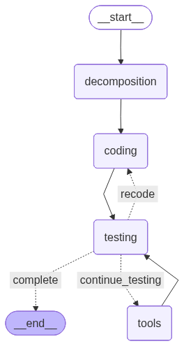

# multi-agent-coding-squad



---

## What is this?

A small multi-agent system where three AI agents collaborate to write and verify code:

- **Architect** — takes your request and breaks it down into a clear technical plan
- **Coder** — implements the plan, fixes bugs if the tester complains
- **Tester** — runs the code in a REPL, checks the output, and either signs off or files a bug report

If the tester finds a problem, the coder tries again.

---

## Stack

- [LangGraph](https://github.com/langchain-ai/langgraph) — agent graph orchestration
- [LangChain](https://github.com/langchain-ai/langchain) — LLM wrappers and prompt templates
- [FastAPI](https://fastapi.tiangolo.com/) + [Uvicorn](https://www.uvicorn.org/) — async HTTP server with SSE streaming
- OpenAI-compatible API (configured via OpenRouter or direct OpenAI)
- Vanilla HTML/JS frontend — no build step needed

---

## Project structure

```
multi-agent-coding-squad/
├── src/
│   ├── api/
│   │   ├── agent/
│   │   │   ├── agent.py        # AgentSquad — all three agents + graph definition
│   │   │   ├── tools.py        # python_repl_tool
│   │   │   └── session_store.py# TTL-based session cache
│   │   └── main.py             # FastAPI app + /invoke endpoint
│   ├── config.py
│   └── logging.py
├── app/
│   └── index.html              # Frontend UI
├── media/
│   └── graph.png               # Auto-generated LangGraph diagram
└── pyproject.toml
```

---

## Setup

**Requirements:** Python 3.12.7+, [uv](https://github.com/astral-sh/uv)

```bash
git clone https://github.com/HELLRAISER3/multi-agent-coding-squad
cd multi-agent-coding-squad
uv sync
```

Create a `.env` file:

```env
OPENAI_API_KEY=your_key_here
OPENAI_BASE_URL=https://openrouter.ai/api/v1  # or https://api.openai.com/v1
```

---

## Running

```bash
uv run uvicorn src.api.main:app --port 8000
```

Then open `app/index.html` in your browser (or serve it on any static host).

---

## Graph



---

## Limitations

- The tester runs arbitrary Python code locally — don't expose this to the public internet
- `gpt-4o-mini` is used by default; complex tasks may benefit from a stronger model
- The feedback loop caps at 3 recode attempts to avoid runaway costs